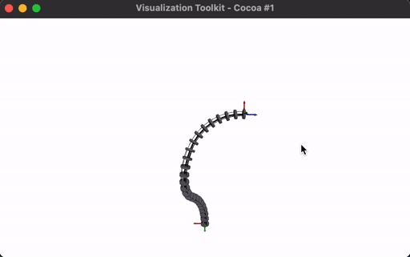

# Kinematic Modeling of a Tendon Driven Continuum Robot
This project implement Kinematic Model for Tendon Driven Continuum Robot from course of Prof. Jessica Burgner-Kahrs CSC476/2606 - Introduction to Continuum Robotics at UofT.

## Execution
```
mkdir build
cd build
cmake .. -DCMAKE_BUILD_TYPE=Release
make
./csc476-simulation-framework a2
```

